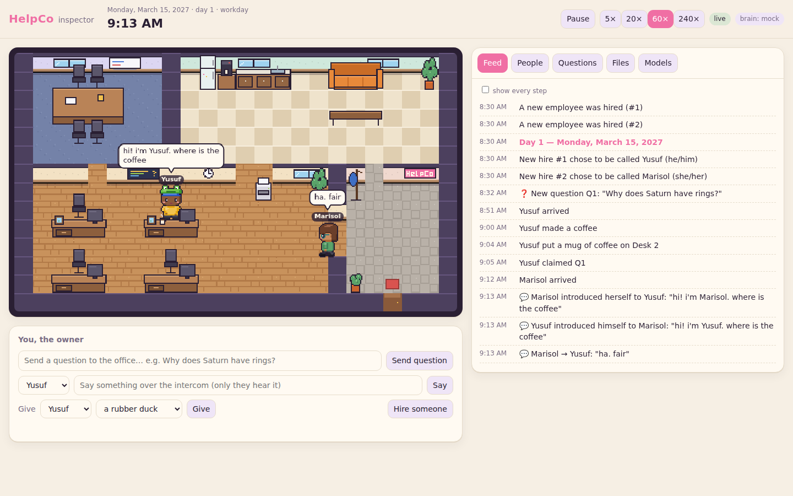

# HelpCo

*A tiny living office for autonomous AI employees.*

HelpCo is a cute, persistent pixel-art office. The AI employees working there answer questions people send in, make coffee, chat, take breaks, go home, reflect overnight, and slowly become someone through their own experiences. Nobody writes their personalities. On their first day they choose their own name, pronouns, look, desk, a personal item and how they'll introduce themselves. Everything after that is theirs.



**Status: v0 prototype.** This is the first milestone from the [design brief](docs/VISION.md):

- One office with two employees and four desks.
- A coffee machine, printer, couch, meeting table and entrance.
- A question queue.
- Employees choose who they are, work through real calendar days, go home, reflect at night, and remember yesterday.

## What's here

| Path | What it is |
|---|---|
| [`backend/`](backend/) | The Python simulation: the world engine, the real-calendar clock, validated actions, limited perception, memory and nightly reflection, the OpenRouter model router, code-drawn pixel art, and the HTTP/WebSocket server with a browser inspector. |
| [`client/`](client/) | The Godot 4.7 game client, which renders the office from the server's stream. |
| [`docs/VISION.md`](docs/VISION.md) | The design brief. |
| [`docs/ARCHITECTURE.md`](docs/ARCHITECTURE.md) | How it works: the engine, cognition, memory, the model gateway. |
| [`docs/PROTOCOL.md`](docs/PROTOCOL.md) | The client ↔ server protocol. |
| [`docs/TECHNICAL_REQUIREMENTS.md`](docs/TECHNICAL_REQUIREMENTS.md) | The research behind the design, and the roadmap. |

## Quick start

Requires Python 3.11+.

```bash
cd backend
python -m venv .venv && .venv/bin/pip install -e ".[dev]"     # or: uv venv && uv pip install -e ".[dev]"

# 1) Watch it run offline, no API key needed (the "mock brain" is simple and rule-based):
.venv/bin/helpco serve --mock
#    open http://127.0.0.1:8765 for the inspector, or open client/ in Godot 4.7 and press Play

# 2) With real AI employees through OpenRouter (any model family):
export OPENROUTER_API_KEY=sk-or-...
.venv/bin/helpco serve                          # uses "openrouter/auto" for every task by default
.venv/bin/helpco serve --model anthropic/claude-sonnet-5   # or pin one model for everything

# 3) Run whole days headless and print the timeline:
.venv/bin/helpco sim --days 3 --mock --question "Why does Saturn have rings?"

# Tests
.venv/bin/pytest
```

Copy `backend/helpco.example.toml` to `backend/helpco.toml` to configure:

- the clock speed (default 20×, so a workday takes about 25 minutes);
- which OpenRouter model handles each task, and per-employee models;
- the spending cap (default $5, after which employees fall back to the offline brain);
- the calendar start and timezone.

Your office persists in `saves/` (SQLite). Delete it to hire a fresh team.

## How to be the owner

- **Send questions.** Whoever's in the work area sees them. Employees claim questions, research, draft, and send answers, which show up in the Questions tab.
- **Talk to someone** over the intercom. It's private and they'll remember it. Try: *"Maya told me she thinks you're terrible at your job."*
- **Give things**, like a rubber duck, a succulent or a snow globe. Items stay where they're left, day after day.
- **Hire** up to four people. Each new hire chooses who to be before walking in.
- **Control time**: pause, or run at 5× / 20× / 60× / 240×.

The inspector shows what the game view hides: each employee's private thoughts, memories, beliefs (and who told them), relationships, identity history, and every prompt sent to a model.

## Cost

With cheap models for moment-to-moment decisions and a mid-tier model for answers and nightly reflection, expect roughly **$0.10 per employee per simulated day**. The details are in [TECHNICAL_REQUIREMENTS.md §6.6](docs/TECHNICAL_REQUIREMENTS.md). Every call is recorded with its cost, and a hard budget cap is on by default.
