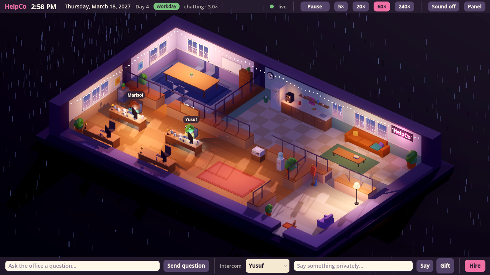

# HelpCo — Godot client

A cozy 3D isometric view of the office, rendered live from the HelpCo server.

## Run

1. Start the server: `cd backend && .venv/bin/helpco serve --mock` (see the main README).
2. Open this folder in **Godot 4.7** and press Play, or run
   `godot --path client -- --server=127.0.0.1:8765`.

The client uses the Compatibility (OpenGL) renderer, so it runs on older GPUs too.

## Controls

| Input | Does |
|---|---|
| Click / tap someone | Select them (the camera follows; their card opens in the side panel) |
| Drag (mouse or one finger), WASD / arrows | Pan |
| Wheel, pinch, `+` / `-` | Zoom |
| `Home` / `Esc` | Frame the whole office (`Esc` also deselects) |
| `Space` | Pause / resume the simulation clock |
| `M` or the **Sound** button | Soft ambient sound on/off |
| `R` | Weather: auto → rain → clear |
| `F3` | Side panel |
| `F2` | Corner-of-the-monitor mode |

## Command-line options

Pass after `--`:

| Option | Meaning |
|---|---|
| `--server=HOST:PORT` | Server to connect to (remembered for next time) |
| `--select=emp_1` | Select an employee on start |
| `--panel=on\|off`, `--tab=feed` | Side panel state |
| `--zoom=0.4` | Start zoomed in (smaller is closer) |
| `--hour=19` | Pin the lighting to an hour of the day |
| `--weather=rain\|clear` | Pin the weather |
| `--sound=on` | Start with sound on |
| `--screenshot=out.png`, `--screenshot-at=S`, `--screenshot-every=S`, `--quit-after-seconds=N` | Automation and screenshots |
